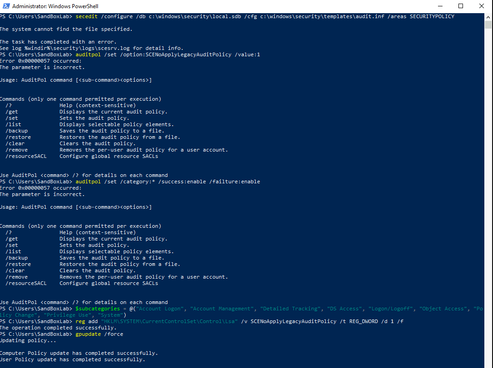

### **STIG Compliance: Enabling Audit Policy Subcategories (WN10-SO-000030)**

Audit logs are essential for detecting suspicious activities, troubleshooting system issues, and ensuring compliance with security policies. By **enabling audit policy subcategories**, administrators can achieve more precise logging control and ensure forensic integrity. This script enforces the required policy settings to comply with STIG ID: **WN10-SO-000030**.





```powershell
<#
.SYNOPSIS
    This PowerShell script enables audit policy subcategories to comply with STIG ID: WN10-SO-000030.

.DESCRIPTION
    - Ensures audit policy subcategory settings override category settings.
    - Uses `auditpol.exe` to configure each subcategory individually.
    - Modifies Local Security Policy settings to enforce security.
    - Applies the policy using Group Policy updates.

.NOTES
    Author          : Anthony Lewallen
    LinkedIn        : https://www.linkedin.com/in/anthony-lewallen
    Website         : https://lewallenae.github.io/Cybersecurity-lab/
    GitHub          : https://github.com/LewallenAE/Cybersecurity-lab
    Date Created    : 2025-02-19
    Last Modified   : 2025-02-19
    Version         : 1.2
    CVEs            : N/A
    Plugin IDs      : N/A
    STIG-ID         : WN10-SO-000030

.TESTED ON
    Date(s) Tested  : 2025-02-19
    Tested By       : Anthony Lewallen
    Systems Tested  : Windows 10
    PowerShell Ver. : 5.1+

.USAGE
    Run this script in an **elevated PowerShell session** to enable audit policy subcategories.

    Example usage:
    PS C:\> .\STIG-WN10-SO-000030.ps1 
#>

# Ensure the script is running as Administrator
$adminCheck = [System.Security.Principal.WindowsPrincipal]::new([System.Security.Principal.WindowsIdentity]::GetCurrent()).IsInRole([System.Security.Principal.WindowsBuiltInRole]::Administrator)
if (-not $adminCheck) {
    Write-Host "ERROR: This script must be run as Administrator!" -ForegroundColor Red
    Exit
}

# Step 1: Enable Audit Policy Subcategories Using auditpol.exe (One at a Time)
Write-Host "`n[Step 1] Enabling Audit Policy Subcategories..."
$subcategories = @(
    "Account Logon", "Account Management", "Detailed Tracking",
    "DS Access", "Logon/Logoff", "Object Access", "Policy Change", "Privilege Use",
    "System"
)

foreach ($subcategory in $subcategories) {
    Write-Host "Enabling audit policy for: $subcategory"
    Start-Process -NoNewWindow -FilePath "auditpol.exe" -ArgumentList "/set /subcategory:'$subcategory' /success:enable /failure:enable" -Wait
}

# Step 2: Modify Registry Settings for Audit Policy
Write-Host "`n[Step 2] Modifying Registry Settings..."
reg add "HKLM\SYSTEM\CurrentControlSet\Control\Lsa" /v SCENoApplyLegacyAuditPolicy /t REG_DWORD /d 1 /f

# Step 3: Apply Group Policy Updates
Write-Host "`n[Step 3] Applying Group Policy Updates..."
gpupdate /force

# Step 4: Verify Audit Policy Subcategory Enforcement
Write-Host "`n[Step 4] Verifying Audit Policy Subcategory Setting..."
(Get-ItemProperty -Path "HKLM:\SYSTEM\CurrentControlSet\Control\Lsa" -Name "SCENoApplyLegacyAuditPolicy").SCENoApplyLegacyAuditPolicy

Write-Host "`n✅ STIG WN10-SO-000030 has been successfully applied!" -ForegroundColor Green
```
