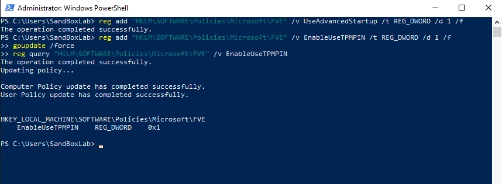

# **BitLocker Remediation**





```powershell
<#
.SYNOPSIS
    This PowerShell script enforces BitLocker pre-boot authentication with a PIN to comply with STIG ID: WN10-00-000031.

.DESCRIPTION
    - Configures BitLocker to require a PIN at startup.
    - Enforces Group Policy settings for additional authentication.
    - Ensures TPM Startup PIN is enabled.
    - Applies the policy using Group Policy updates.

.NOTES
    Author          : Anthony Lewallen
    LinkedIn        : https://www.linkedin.com/in/anthony-lewallen
    Website         : https://lewallenae.github.io/Cybersecurity-lab/
    GitHub          : https://github.com/LewallenAE/Cybersecurity-lab
    Date Created    : 2025-02-19
    Last Modified   : 2025-02-19
    Version         : 1.0
    CVEs            : N/A
    Plugin IDs      : N/A
    STIG-ID         : WN10-00-000031

.TESTED ON
    Date(s) Tested  : 2025-02-19
    Tested By       : Anthony Lewallen
    Systems Tested  : Windows 10
    PowerShell Ver. : 5.1+

.USAGE
    Run this script in an **elevated PowerShell session** to configure BitLocker for pre-boot authentication with a PIN.

    Example usage:
    PS C:\> .\STIG-WN10-00-000031.ps1 
#>

# Ensure the script is running as Administrator
$adminCheck = [System.Security.Principal.WindowsPrincipal]::new([System.Security.Principal.WindowsIdentity]::GetCurrent()).IsInRole([System.Security.Principal.WindowsBuiltInRole]::Administrator)
if (-not $adminCheck) {
    Write-Host "ERROR: This script must be run as Administrator!" -ForegroundColor Red
    Exit
}

# Step 1: Enable BitLocker Additional Authentication at Startup
Write-Host "`n[Step 1] Enabling BitLocker Pre-Boot Authentication with PIN..."
reg add "HKLM\SOFTWARE\Policies\Microsoft\FVE" /v UseAdvancedStartup /t REG_DWORD /d 1 /f

# Step 2: Require Startup PIN with TPM
Write-Host "`n[Step 2] Configuring TPM Startup PIN Requirement..."
reg add "HKLM\SOFTWARE\Policies\Microsoft\FVE" /v EnableUseTPMPIN /t REG_DWORD /d 1 /f

# Step 3: Apply Group Policy Updates
Write-Host "`n[Step 3] Applying Group Policy Updates..."
gpupdate /force

# Step 4: Verify the BitLocker PIN Policy
Write-Host "`n[Step 4] Verifying BitLocker Pre-Boot Authentication Policy..."
reg query "HKLM\SOFTWARE\Policies\Microsoft\FVE" /v EnableUseTPMPIN

Write-Host "`n✅ STIG WN10-00-000031 has been successfully applied!" -ForegroundColor Green
```
