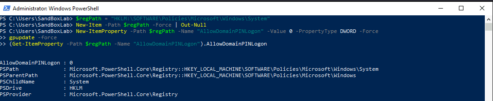

# **Convenience PIN Remediation**




```powershell
<#$
.SYNOPSIS
    This PowerShell script disables the convenience PIN sign-in to comply with STIG ID: WN10-CC-000370.

.DESCRIPTION
    - Ensures convenience PIN sign-in is disabled.
    - Modifies Group Policy settings to enforce security.
    - Applies the policy using Group Policy updates.

.NOTES
    Author          : Anthony Lewallen
    LinkedIn        : https://www.linkedin.com/in/anthony-lewallen
    Website         : https://lewallenae.github.io/Cybersecurity-lab/
    GitHub          : https://github.com/LewallenAE/Cybersecurity-lab
    Date Created    : 2025-02-19
    Last Modified   : 2025-02-19
    Version         : 1.0
    CVEs            : N/A
    Plugin IDs      : N/A
    STIG-ID         : WN10-CC-000370

.TESTED ON
    Date(s) Tested  : 2025-02-19
    Tested By       : Anthony Lewallen
    Systems Tested  : Windows 10
    PowerShell Ver. : 5.1+

.USAGE
    Run this script in an **elevated PowerShell session** to disable convenience PIN sign-in.

    Example usage:
    PS C:\> .\STIG-WN10-CC-000370.ps1 
#>

# Ensure the script is running as Administrator
$adminCheck = [System.Security.Principal.WindowsPrincipal]::new([System.Security.Principal.WindowsIdentity]::GetCurrent()).IsInRole([System.Security.Principal.WindowsBuiltInRole]::Administrator)
if (-not $adminCheck) {
    Write-Host "ERROR: This script must be run as Administrator!" -ForegroundColor Red
    Exit
}

# Step 1: Ensure the Registry Path Exists
Write-Host "`n[Step 1] Ensuring Registry Path Exists..."
$regPath = "HKLM:\SOFTWARE\Policies\Microsoft\Windows\System"
if (-not (Test-Path $regPath)) {
    Write-Host "Registry path does not exist. Creating it..." -ForegroundColor Yellow
    New-Item -Path $regPath -Force | Out-Null
}

# Step 2: Disable Convenience PIN Sign-in
Write-Host "`n[Step 2] Disabling Convenience PIN Sign-in..."
New-ItemProperty -Path $regPath -Name "AllowDomainPINLogon" -Value 0 -PropertyType DWord -Force

# Step 3: Apply Group Policy Updates
Write-Host "`n[Step 3] Applying Group Policy Updates..."
gpupdate /force

# Step 4: Verify the Convenience PIN Policy
Write-Host "`n[Step 4] Verifying Convenience PIN setting..."
(Get-ItemProperty -Path $regPath -Name "AllowDomainPINLogon").AllowDomainPINLogon

Write-Host "`n✅ STIG WN10-CC-000370 has been successfully applied!" -ForegroundColor Green
```
