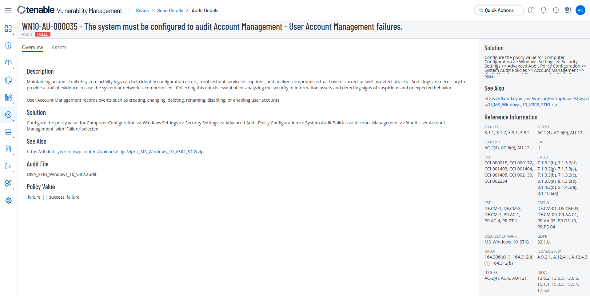
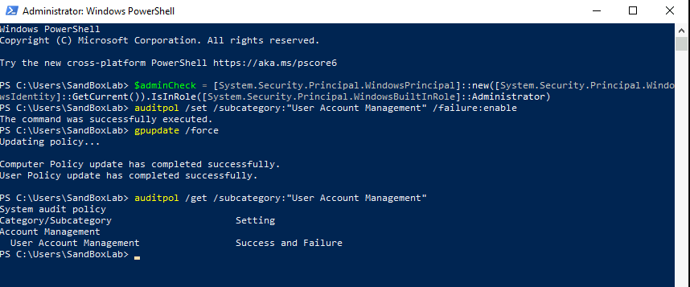

#   :newspaper:  **User Access Management Failure Remediation**


### Implementing the code via PowerShell




```powershell
<#
.SYNOPSIS
    This PowerShell script configures auditing for User Account Management failures to comply with STIG ID: WN10-AU-000035.

.DESCRIPTION
    - Ensures audit logging for User Account Management failures is enabled.
    - Modifies the advanced audit policy settings.
    - Enforces the policy with a Group Policy update.

.NOTES
    Author          : Anthony Lewallen
    LinkedIn        : https://www.linkedin.com/in/anthony-lewallen
    Website         : https://lewallenae.github.io/Cybersecurity-lab/
    GitHub          : https://github.com/LewallenAE/Cybersecurity-lab
    Date Created    : 2025-02-19
    Last Modified   : 2025-02-19
    Version         : 1.0
    CVEs            : N/A
    Plugin IDs      : N/A
    STIG-ID         : WN10-AU-000035

.TESTED ON
    Date(s) Tested  : 2025-02-19
    Tested By       : Anthony Lewallen
    Systems Tested  : Windows 10
    PowerShell Ver. : 5.1+

.USAGE
    Run this script in an **elevated PowerShell session** to configure auditing for User Account Management failures.

    Example usage:
    PS C:\> .\STIG-WN10-AU-000035.ps1 
#>

# Ensure the script is running as Administrator
$adminCheck = [System.Security.Principal.WindowsPrincipal]::new([System.Security.Principal.WindowsIdentity]::GetCurrent()).IsInRole([System.Security.Principal.WindowsBuiltInRole]::Administrator)
if (-not $adminCheck) {
    Write-Host "ERROR: This script must be run as Administrator!" -ForegroundColor Red
    Exit
}

# Step 1: Configure Audit Policy for User Account Management Failures
Write-Host "`n[Step 1] Configuring Audit Policy for User Account Management Failures..."
auditpol /set /subcategory:"User Account Management" /failure:enable

# Step 2: Apply Group Policy Updates
Write-Host "`n[Step 2] Applying Group Policy Updates..."
gpupdate /force

# Step 3: Verify the Audit Policy Configuration
Write-Host "`n[Step 3] Verifying the applied audit policy..."
auditpol /get /subcategory:"User Account Management"

Write-Host "`n✅ STIG WN10-AU-000035 has been successfully applied!" -ForegroundColor Green
```
